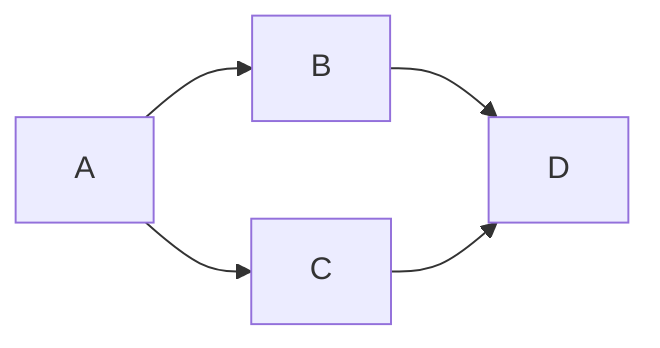

# 1. Hướng dẫn học markdown

**I. Syntax in markdown:**

> [Link tham khảo 1] (https://www.markdownguide.org/cheat-sheet/)

> [Link tham khảo 2] (https://quantrimang.com/cong-nghe/cu-phap-markdown-can-ban-163963)

> Gõ icon trong markdown:
>
> - MacOS: Ctrl + Command + Space
> - Windows: Windows + . (dấu chấm)

**II. Set up một số extension trong vscode cho markdown:**

1.  **Markdown All in One** : Hỗ trợ format, preview Markdown, ...
2.  **Markdown PDF** : Export Markdown trực tiếp ra file pdf.
3.  **Markdown Preview Mermaid** : Hỗ trợ vẽ diagrams trong markdown.

**III. Tạo Header/Footer khi xuất PDF trong vscode cho markdown:**

1. Vào setting.json (Ctrl + ,).
2. Paste đoạn code bên dưới vào setting.json trong tab Workspace:

 

>  `{
  "markdown-pdf.displayHeaderFooter": true,
  "markdown-pdf.headerTemplate": "
Frontend - Học MarkDown 🎉 
 
  
",
  "markdown-pdf.footerTemplate": "
  /  
"
}`

**IV. Thêm diagrams vào markdown:**

> [Link tham khảo] (https://mermaid.js.org/syntax/flowchart.html?id=flowcharts-basic-syntax)

**V. Cắt ngang vị trí cho qua trang pdf khác bằng markdown:**

> `

`